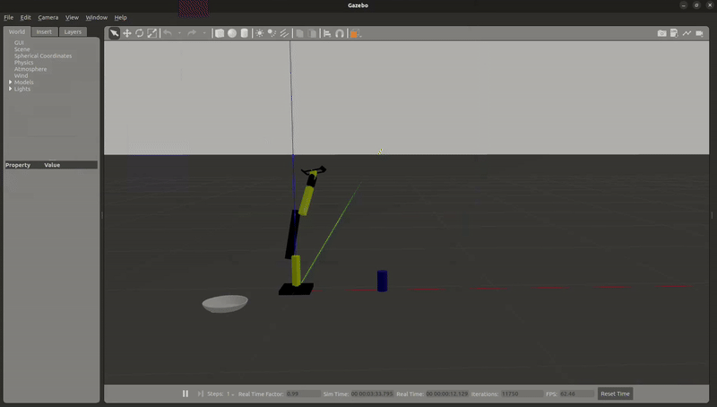

# Rhino (6 D.O.F.)
Rhino is a 6 degree of freedom robotic arm designed to perform tasks like painting, examine, welding, surgeries and simple pick n place. It utilizes *ROS2*, *Gazebo* for simulation, and implemented *MoveIt2* for planning and execution of any task. I've implemented control with the help of *ros2_control* features for precise motor control (made custom hardware interface).




## Table of Contents
1) Features

2) Directory Structure

3) Getting Started 

## Features
1) Achieves accurate movements as it uses IKpy library for calculating inverse kinematics.

2) Basic design helps, custom tools such as grippers, cameras, or sensors to be added easily

3) Simulation environment is Gazebo Classic for testing algorithms. (currently developing the project for Gazebo Sim (fortress))

4) Utilized joint_trajectory_controller in ros2_control for seamless joint control.


# Directory Structure

```
rhino/
|-- config/
|   |-- display.rviz
|   |-- rhino_controller.yaml
|
|-- launch/
|   |-- display.launch.py
|   |-- gazebo.launch.py
|   |-- rhino_controller.launch.py
|   |-- rsp.launch.py
|
|-- meshes/ 
|   |-- base_link.stl
|   |-- link1.stl
|   |-- link2.stl
|   |-- link3.stl
|   |-- link4.stl
|   |-- link5.stl
|   |-- link6a.stl
|   |-- link6b.stl
|
|-- resource/
|   |-- joint_limits.txt
|   |-- rhino
|   |-- task2_in_action.gif
|
|-- rhino/
|   |-- __init__.py
|   |-- feedback_test.py
|   |-- ikpy_testor.py
|   |-- joint_testor.py
|   |-- task1.py
|   |-- task2.py
|
|-- test/
|
|-- urdf/
|   |-- robot.gazebo
|   |-- robot.trans
|   |-- robot.xacro
|   |-- ros2_control.xacro
|
|-- worlds/
|   |-- bowl_object
|   |-- world1
|
|-- package.xml
|
|-- setup.cfg
|
|-- setup.py
```


# Getting Started
1) Clone the repository:- `git clone https://github.com/GradVizor/rhino_six_dof_arm.git` 
   
2) Make sure to install required packages and dependencies by checking out rhino/package.xml.

3) Build your project:
   
   Ensure your build system includes the necessary source files and header paths. 

4) To run "task2" as given in the gif at "rhino/resource/task2_in_action" :- `ros2 run rhino task2` 

5) This robotic arm utilizes ikpy library which is very easy to use and has to be installed before running any executable, do chech out the following github repo:- `https://github.com/Phylliade/ikpy.git`

6) To launch the robot model in gazebo with ros2_controllers plugedin:-

   `ros2 launch rhino rhino_controller.launch.py`

8) To check the joints and to test the urdf run this command to have a look on transforms in rviz2 :- `ros2 launch rhino display.launch.py`

   
